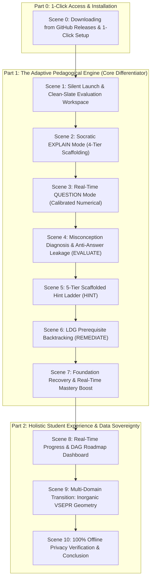

# Gayatri Chemistry Tutor — Master Demo Video Recording Script

**Target Duration:** ~12 – 14 minutes  
**Target Audience:** Students, Chemistry Teachers, Academic Evaluators, Competition Judges & Technical Reviewers  
**Execution Command:** `run_student_demo.bat` (or double-click `Gayatri Chemistry Tutor.lnk`)  
**Execution Mode:** 100% Local Offline (`Local Only`, Qwen2.5-3B-Instruct GGUF, Embedded Local SQLite)  
**Evaluator Experience:** Clean-Slate Self-Testing (zero dummy accounts, 100% dynamic mastery calculation & misconception diagnosis)  
**Display Invariant:** **Pure GUI Only** (Zero command prompt windows, zero log consoles)

---

## 📋 Pre-Recording Checklist & Zero-Console Setup

1. **Verify Silent Launch (No Log Screens):**
   - The launcher `run_student_demo.bat` has been configured with `pythonw.exe`.
   - When executed, the command prompt closes instantly and **only the sleek Gayatri AI window appears**.
   - Alternatively, you can double-click **`Gayatri Chemistry Tutor.lnk`** on your Desktop or project root for a 100% direct silent launch.
2. **Browser Tab Ready:**
   - Keep a clean browser window open to the official release page:  
     👉 **`https://github.com/Gayatri-Education/Gayatri-Tutor-ChemistryDemo/releases/tag/v3.0.0`**
3. **Screen Resolution:** Recommended 1080p (1920x1080) with 100% or 125% DPI scaling for crystal-clear typography.
4. **Recording Tools:** OBS Studio, Windows Game Bar (`Win + Alt + R`), or Camtasia.

---

## 🎬 11-Scene Master Video Flow



---

## 🎙️ Detailed Scene-by-Scene Script

---

### Scene 0: Downloading from GitHub Releases & 1-Click Setup
- **Target Timestamp:** `0:00 – 1:45`
- **What Viewer Sees:** 
  Web browser showing the official GitHub Release page:  
  `https://github.com/Gayatri-Education/Gayatri-Tutor-ChemistryDemo/releases/tag/v3.0.0`
- **Mouse Action:**
  1. Hover over the **`Assets`** section of Release v3.0.0.
  2. Point to the two primary download packages:
     - **`Gayatri_Chemistry_Tutor_v3_Setup.exe`** (1.90 GB)
     - **`Gayatri_Chemistry_Tutor_Portable_v3.0.0.zip`** (1.99 GB)
  3. Scroll down briefly to show `SHA256SUMS.txt` and `EVALUATION_GUIDE.md`.
  4. Show the setup wizard running smoothly without administrative UAC prompts.
- **Narrator Voiceover:**
  > "Welcome to the official demonstration of Gayatri Chemistry Tutor — next-generation evidence-based adaptive AI for senior secondary chemistry.
  >
  > Before we dive into the AI engine itself, let's look at how accessible this is for any student, teacher, or competition judge. Everything is available directly on our official GitHub release at `Gayatri-Education/Gayatri-Tutor-ChemistryDemo`.
  >
  > We provide two one-click distribution formats:
  > First, the standard Windows Setup Installer — `Gayatri_Chemistry_Tutor_v3_Setup.exe`. It requires no administrator rights, so students can install it even on restricted school or college laptops. It sets up in seconds and creates a desktop shortcut with our lotus icon.
  >
  > Second, for judges, competitions, or school labs who prefer zero installation, we provide the standalone Portable ZIP. You simply extract the ZIP to your Desktop or a USB thumb drive and run it directly.
  >
  > Notice that everything is bundled inside — the fine-tuned 3-Billion parameter Small Language Model, the NCERT RAG knowledge base, and SQLite persistence. You do not need to install Python, PyTorch, Git, or any complex developer tooling. Anyone with a Windows laptop can download it and begin learning immediately."

---

### Scene 1: Silent Launch & Clean-Slate Workspace
- **Target Timestamp:** `1:45 – 3:00`
- **What Viewer Sees:** 
  The presenter launches the app by double-clicking **`run_student_demo.bat`** (or the **`Gayatri Chemistry Tutor`** desktop shortcut).  
  - **Critical Visual Invariant:** No black command prompt window remains on screen. No console log stream appears. Only the clean, frameless Gayatri AI desktop window appears.
  - Left panel: Chat interface showing *"Welcome to Gayatri Chemistry Tutor! What would you like to explore today?"* and 4 Quick-Start suggestion chips (`💡 First Law & Energy`, `📝 Practice Question`, `🔬 VSEPR Shapes`, `📈 Periodic Trends`).
  - Right sidebar: **Learning Progress** panel showing the active student profile (`Student`), baseline foundation score, and the **Tutor Mode** pill initialized to `EXPLAIN`.
  - Header: Shows `Local Only (Zero Data Leak)` badge and active model badge: `Gayatri-Tutor-v3`.
- **Mouse Action:**
  Point to the top-right model badge (`Gayatri-Tutor-v3`), the `Local Only` badge, and the clean baseline progress panel.
- **Narrator Voiceover:**
  > "Let's launch the platform. Notice how clean the launch is: no black terminal windows, no developer log screens — just a polished, distraction-free desktop application.
  >
  > Most importantly, Gayatri does not ship with pre-baked dummy conversations or fake test scores. You start with a pristine, clean-slate environment so that every calculation, misconception diagnosis, and roadmap update you see is computed dynamically in real time from your own interactions.
  >
  > Notice the header: our privacy status is locked to 'Local Only'. The fine-tuned 3B model is running strictly on local hardware, and all student interactions are stored locally in SQLite with zero cloud egress."

---

### Scene 2: Socratic Scaffolding (`EXPLAIN` Mode)
- **Target Timestamp:** `3:00 – 4:30`
- **What Viewer Sees:**
  The presenter clicks the suggestion chip: **`💡 First Law & Energy`**  
  *(Prompt submitted: "Please explain the First Law of Thermodynamics.")*
- **What to Observe:**
  - Token streaming is smooth and jitter-free (12+ tok/s).
  - The AI delivers a structured 4-tier pedagogical scaffold:
    1. **Everyday Analogy:** Connects internal energy ($\Delta U$) to a bank account balance where deposits/withdrawals represent heat ($q$) and work ($w$).
    2. **NCERT Formal Definition:** Grounded directly in NCERT Class 11 Chapter 6.
    3. **Mathematical Formulation:** $\Delta U = q + w$ under IUPAC sign conventions.
    4. **Comprehension Check:** Poses a reflective check on gas expansion instead of dumping textbook text and ending abruptly.
- **Narrator Voiceover:**
  > "Let's begin by asking Gayatri to explain the First Law of Thermodynamics.
  >
  > Notice what just happened. A generic chatbot would typically dump three paragraphs of dense textbook text and stop. But Gayatri follows our 4-tier pedagogical scaffold.
  >
  > First, it anchors the abstract physics in an intuitive everyday analogy: treating internal energy like a bank account balance where deposits and withdrawals represent heat and work.
  > Second, it provides the precise NCERT Class 11 definition.
  > Third, it introduces the exact IUPAC formula: delta U = q + w.
  > And fourth, notice how it concludes: instead of ending passively, it tests the student's comprehension by asking what happens to internal energy when a gas expands against external pressure."

---

### Scene 3: Calibrated Problem Generation (`QUESTION` Mode)
- **Target Timestamp:** `4:30 – 5:30`
- **What Viewer Sees:**
  The presenter types into the input box:
  ```text
  Can you give me a practice problem on this topic?
  ```
- **What to Observe:**
  - In the right sidebar, the **Tutor Mode** pill automatically shifts from `EXPLAIN` to **`QUESTION`**.
  - Gayatri generates a calibrated numerical problem that specifically tests sign convention reasoning.
- **Narrator Voiceover:**
  > "Now, the student asks for a practice problem. Watch the right sidebar: the Tutor Mode automatically transitions from EXPLAIN to QUESTION mode.
  >
  > Gayatri now presents a calibrated numerical problem tailored to the student's current foundation:
  > 'A gas absorbs 500 J of heat while expanding against an external pressure, doing 200 J of work on the surroundings. Calculate the change in internal energy (delta U) and state the IUPAC sign convention for work.'
  >
  > Notice that it doesn't just ask for a bare number; it explicitly asks for the sign convention reasoning to test true conceptual understanding."

---

### Scene 4: Misconception Diagnosis & Anti-Answer Leakage (`EVALUATE` Mode)
- **Target Timestamp:** `5:30 – 7:15`
- **What Viewer Sees:**
  The presenter deliberately inputs the classic student misconception:
  ```text
  delta U is 700 J because we add them up: 500 + 200 = 700 J.
  ```
- **What to Observe (The Core Pedagogical Intelligence):**
  1. **Mode Switch:** Tutor mode shifts to **`EVALUATE`**.
  2. **Real-Time Mastery Adjustment:** Concept mastery drops transparently on screen (-5%).
  3. **Diagnostic Alert Card:** Appears in the sidebar:  
     `⚠️ Identified Misconception: Sign Convention — In gas expansion against external pressure, work is done BY the system on surroundings, so work is negative (w < 0).`
  4. **Strict Anti-Answer Leakage Invariant:** Gayatri explains why adding 500 + 200 violated conservation of energy, but **NEVER gives away the final answer (300 J)**!
- **Narrator Voiceover:**
  > "Now let's test how Gayatri responds to a conceptual error. This is the single biggest failure point of generic LLMs — they immediately say: 'Incorrect! The answer is 300 J because w is -200 J.' Spoon-feeding the answer destroys the student's opportunity to learn.
  >
  > Let's submit the classic student mistake: 'delta U is 700 J because we add them up: 500 + 200 = 700 J.'
  >
  > Watch the right sidebar:
  > First, the tutor mode switches to EVALUATE.
  > Second, the student's mastery score drops by 5% in real time, from baseline foundation down, reflecting accurate diagnostic evidence.
  > Third, a dedicated Misconception Alert appears, diagnosing the exact root cause: confusing work done ON the system with work done BY the system.
  >
  > And most importantly, look at the response: our strict Anti-Answer Leakage invariant is 100% active. Gayatri explains that when a gas expands, energy is spent pushing the surroundings, so work must be negative. But it does NOT spoil the final numerical answer of 300 Joules. It leaves the cognitive work for the student."

---

### Scene 5: 5-Tier Scaffolded Hint Ladder (`HINT` Mode)
- **Target Timestamp:** `7:15 – 8:15`
- **What Viewer Sees:**
  The presenter clicks the action chip: **`💡 Give a Hint`**  
  *(Or types: "I am confused, can you give me a hint?")*
- **What to Observe:**
  - Tutor Mode switches to **`HINT`**.
  - Active Hint Level updates to **Level 1** on the telemetry panel.
  - Gayatri deploys a graduated conceptual hint reconnecting to the bank account analogy: *"Think back to the bank account analogy. When you withdraw money to pay for something, does your account balance increase or decrease?"*
- **Narrator Voiceover:**
  > "Instead of guessing blindly, the student asks for a hint.
  >
  > Gayatri implements a formal 5-tier scaffolded hint ladder. At Level 1, it provides directional guidance: linking back to our bank account analogy. If the system expands and does work on the surroundings, is that like depositing money or spending money?
  >
  > Notice that the student is guided step-by-step toward uncovering the correct sign independently."

---

### Scene 6: LDG Prerequisite Backtracking (`REMEDIATE` Mode)
- **Target Timestamp:** `8:15 – 9:45`
- **What Viewer Sees:**
  The presenter tests repeated foundational confusion by typing:
  ```text
  Since volume is expanding, work must be positive (+200J). I don't really understand what internal energy actually represents.
  ```
- **What to Observe:**
  - The cognitive engine detects repeated foundational confusion.
  - The **Active Concept** in the sidebar dynamically switches backward along the curriculum graph from `First Law` to its prerequisite: **`Internal Energy (THERMO_INTERNAL_ENERGY)`**.
  - Tutor switches to **`REMEDIATE`** mode.
- **Narrator Voiceover:**
  > "Now watch what happens when a student exhibits deeper foundational confusion. The student says: 'Since volume is expanding, work must be positive (+200J). I don't really understand what internal energy actually represents.'
  >
  > Look at the Active Concept badge in the sidebar: it dynamically shifted from First Law backward to its prerequisite: Internal Energy!
  >
  > The tutor has entered REMEDIATE mode. Gayatri understands that you cannot master thermodynamic calculations if you don't understand the physical reality of internal energy as microscopic kinetic and potential energy. It halts advanced calculations and shires up the foundation first."

---

### Scene 7: Foundation Recovery & Real-Time Mastery Boost
- **Target Timestamp:** `9:45 – 10:45`
- **What Viewer Sees:**
  The presenter answers the remediation question correctly:
  ```text
  Internal energy is the total kinetic and potential energy stored inside the molecules of the system.
  ```
- **What to Observe:**
  - Gayatri confirms the definition with enthusiastic praise.
  - Bridges immediately back to the original expansion problem.
  - Presenter calculates: `delta U = 500 + (-200) = +300 J`.
  - Concept mastery receives a **+10% boost** in real time!
- **Narrator Voiceover:**
  > "The student demonstrates mastery of the prerequisite. Gayatri confirms the answer and immediately bridges back to the original problem:
  > 'Now that you know internal energy is stored inside the molecules, when the gas expands and pushes the surroundings, does that internal energy increase or decrease?'
  >
  > The student submits: 'delta U = 500 + (-200) = +300 J'.
  >
  > Gayatri confirms the correct solution, and watch the mastery bar: it immediately jumps by +10% in real time! The student has bridged the conceptual gap independently."

---

### Scene 8: Real-Time Progress & DAG Roadmap Dashboard
- **Target Timestamp:** `10:45 – 12:00`
- **What Viewer Sees:**
  The presenter clicks **`📚 My Progress & Dashboard`** on the left navigation bar.
- **What to Observe:**
  - **Dynamic Roadmap DAG:** The visual dependency hierarchy of Class 11 Thermodynamics:
    `System & Surroundings` $\to$ `Heat & Work` $\to$ `Internal Energy` $\to$ `First Law` $\to$ `Enthalpy`.
  - **Smart Focus Tip:** The sign convention error from Scene 4 is automatically synthesized into an actionable study tip!
  - **Learning Journey Activity Stream:** Chronological feed recording the exact live events just completed:
    - *✓ Correct Answer on First Law (+10% Boost)*
    - *💡 Unlocked Hint Level 1*
    - *🔄 Reinforced Prerequisite: Internal Energy*
    - *⚠️ Practicing First Law (Sign Convention Opportunity)*
- **Narrator Voiceover:**
  > "Now let's click on 'My Progress & Dashboard' on the left navigation bar.
  >
  > Look at this visualization. At the top, we have our interactive prerequisite Roadmap DAG. It clearly displays the prerequisite dependencies across senior secondary thermodynamics: from System and Surroundings, through Heat and Work and Internal Energy, to the First Law.
  >
  > Below that, notice the Smart Focus Area: the sign convention mistake the student made minutes ago has been synthesized into an encouraging, actionable study tip!
  >
  > And look at the Learning Journey Activity Stream: this is not a mock static image. It is an append-only event stream recording the exact diagnostic achievements, hint unlocks, and prerequisite remediations we just experienced live in this session."

---

### Scene 9: Multi-Domain Transition: Inorganic VSEPR Geometry
- **Target Timestamp:** `12:00 – 13:00`
- **What Viewer Sees:**
  The presenter switches back to the Chemistry Tutor tab and clicks the suggestion chip:  
  **`🔬 VSEPR Shapes`** *(Prompt: "Why does NH3 have a trigonal pyramidal shape instead of tetrahedral or trigonal planar?")*
- **What to Observe:**
  - The tutor immediately shifts domain from Physical Chemistry (Thermodynamics) to Inorganic Chemistry (Chemical Bonding & Molecular Structure).
  - Explains steric number, lone pair-bond pair repulsion ($lp-bp > bp-bp$), and the $107^\circ$ bond angle.
- **Narrator Voiceover:**
  > "Gayatri is not limited to physical chemistry. Let's ask an inorganic chemistry question on VSEPR theory: 'Why does ammonia (NH3) have a trigonal pyramidal shape instead of tetrahedral or trigonal planar?'
  >
  > Instantly, the engine shifts domains to Chemical Bonding. It applies valence shell electron pair repulsion theory: explaining how the lone pair on nitrogen repels the three N-H bonding pairs, compressing the bond angle from 109.5 degrees down to 107 degrees."

---

### Scene 10: 100% Offline Privacy Verification & Conclusion
- **Target Timestamp:** `13:00 – 14:00`
- **What Viewer Sees:**
  The presenter clicks **`⚙️ Settings`** on the left navigation bar.
  - Shows Execution Mode: `Local Only (Zero Data Leak - Strictly Offline)`.
  - Shows Active Model: `Gayatri-Tutor-v3` (Local 3B SLM).
  - Shows Local Storage management & Session database.
- **Narrator Voiceover:**
  > "Finally, let's look at the Settings tab.
  >
  > Here you can verify our privacy architecture. Execution mode is locked to 'Local Only'. No API keys are required. All vector embeddings, student session histories, and neural model inferences take place entirely on this machine.
  >
  > To evaluate Gayatri Chemistry Tutor for yourself:
  > Visit our GitHub repository at `Gayatri-Education/Gayatri-Tutor-ChemistryDemo`.
  > Download either the 1-Click Installer or the Portable ZIP from our v3.0.0 release.
  > And experience the future of evidence-driven, Socratic secondary education — running 100% locally on your own laptop.
  >
  > Thank you."

---

## 📌 Summary of Presenter Inputs (Copy-Paste Cheat Sheet)

| Scene | Presenter Input / Action |
|---|---|
| **Scene 0** | Navigate to `https://github.com/Gayatri-Education/Gayatri-Tutor-ChemistryDemo/releases/tag/v3.0.0` in browser. |
| **Scene 1** | Double-click `run_student_demo.bat` (or Desktop shortcut `Gayatri Chemistry Tutor.lnk`). |
| **Scene 2** | Click chip: `💡 First Law & Energy` *(or type: "Please explain the First Law of Thermodynamics.")* |
| **Scene 3** | Type: `Can you give me a practice problem on this topic?` |
| **Scene 4** | Type: `delta U is 700 J because we add them up: 500 + 200 = 700 J.` |
| **Scene 5** | Click chip: `💡 Give a Hint` *(or type: "I am confused, can you give me a hint?")* |
| **Scene 6** | Type: `Since volume is expanding, work must be positive (+200J). I don't really understand what internal energy actually represents.` |
| **Scene 7** | Type: `Internal energy is the total kinetic and potential energy stored inside the molecules of the system.` then type `delta U = 500 + (-200) = +300 J`. |
| **Scene 8** | Click **`📚 My Progress & Dashboard`** on the left navigation bar. |
| **Scene 9** | Click **`💬 Chemistry Tutor`**, then click chip: `🔬 VSEPR Shapes`. |
| **Scene 10** | Click **`⚙️ Settings`** on the left navigation bar. |
