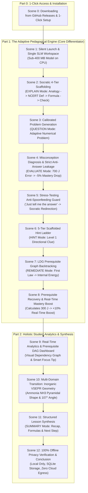

# Gayatri Chemistry Tutor — Master Demo Video Recording Script

**Target Duration:** ~12 – 14 minutes  
**Target Audience:** Students, Chemistry Teachers, Academic Evaluators, Competition Judges & Technical Reviewers  
**Execution Command:** `run.bat` (or double-click `run.lnk` / `Gayatri Chemistry Tutor.lnk`)  
**Execution Mode:** 100% Local Offline (`Local Only`, Standalone ~380 MB GGUF Small Language Model, Embedded Local SQLite)  
**Evaluator Experience:** Clean-Slate Self-Testing (zero dummy accounts, 100% dynamic mastery calculation & misconception diagnosis)  
**Display Invariant:** **Pure GUI Only** (Zero command prompt windows, zero log consoles)

---

## 📋 Pre-Recording Checklist & Zero-Console Setup

1. **Verify Silent Launch (No Log Screens & Elegant Splash Screen):**
   - The launcher `run.bat` (or shortcut `run.lnk` with the app's lotus icon) executes via `pythonw.exe`.
   - When launched, an elegant dark splash screen appears immediately with the glowing lotus logo and live loading progress ("Starting local environment...", "Loading Socratic neural weights...", "Ready! Opening workspace...").
   - **Only when the entire UI has fully loaded does the splash screen transition smoothly to the main application window.**
   - No black terminal windows or console logs ever appear on screen.
2. **Single SLM Active & Verified:**
   - Active model file: `Gayatri-Tutor-SLM-Q4_K_M.gguf` (~380 MB).
   - In Settings or header: Shows `Gayatri-Tutor-SLM` with `✓ Verified & Ready`.
   - Runs directly on standard laptop CPU with 30+ tokens/second and sub-1.2 GB RAM footprint.
3. **Browser Tab Ready:**
   - Keep a clean browser window open to the official release page:  
     👉 **`https://github.com/Gayatri-Education/Gayatri-Tutor-ChemistryDemo/releases/tag/v3.0.0`**
4. **Screen Resolution:** Recommended 1080p (1920x1080) with 100% or 125% DPI scaling for crystal-clear typography.
5. **Recording Tools:** OBS Studio, Windows Game Bar (`Win + Alt + R`), or Camtasia.

---

## 🎬 12-Scene Master Video Flowchart



---

## 🎙️ Detailed Scene-by-Scene Script

---

### Scene 0: Downloading from GitHub Releases & 1-Click Setup
- **Target Timestamp:** `0:00 – 1:30`
- **What Viewer Sees:** 
  Web browser showing the official GitHub Release page:  
  `https://github.com/Gayatri-Education/Gayatri-Tutor-ChemistryDemo/releases/tag/v3.0.0`
- **Mouse Action:**
  1. Hover over the **`Assets`** section of Release v3.0.0.
  2. Point to the two primary download packages:
     - **`Gayatri_Chemistry_Tutor_v3_Setup.exe`** (1.90 GB) — Setup wizard with desktop shortcut.
     - **`Gayatri_Chemistry_Tutor_Portable_v3.0.0.zip`** (1.99 GB) — Zero-install portable bundle.
  3. Briefly point out `SHA256SUMS.txt` and `EVALUATION_GUIDE.md`.
- **Narrator Voiceover:**
  > "Welcome to the official demonstration of Gayatri Chemistry Tutor — next-generation evidence-based adaptive AI for senior secondary chemistry.
  >
  > Before we explore the pedagogical engine, let's look at how accessible this platform is. Everything is published directly on our official GitHub release at `Gayatri-Education/Gayatri-Tutor-ChemistryDemo`.
  >
  > We provide two one-click distribution formats:
  > First, the standard Windows Setup Installer — `Gayatri_Chemistry_Tutor_v3_Setup.exe`. It requires zero administrator permissions, meaning students can install it seamlessly even on restricted school or college laptops. It installs in seconds and places our lotus shortcut right on the desktop.
  >
  > Second, for academic evaluators, competitions, or school computer labs who prefer zero installation, we provide the standalone Portable ZIP. You simply extract the ZIP and run it directly.
  >
  > Everything is self-contained inside — the neural weights, the NCERT atomic knowledge base, and local SQLite persistence. You do not need to install Python, PyTorch, CUDA, or Git. Anyone with a Windows laptop can begin learning immediately."

---

### Scene 1: Silent Launch & Single SLM Workspace
- **Target Timestamp:** `1:30 – 2:30`
- **What Viewer Sees:** 
  The presenter double-clicks **`run.bat`** (or the shortcut **`run.lnk`** with the lotus icon).  
  - **Splash Screen Appears First:** An elegant dark splash screen appears immediately with the glowing lotus logo, title, and live loading progress ("Starting local environment...", "Loading Socratic neural weights...", "Ready! Opening workspace...").
  - **Smooth Reveal:** Only when the entire UI and DOM have fully loaded does the splash smoothly close and reveal the full application window.
  - **Critical Visual Invariant:** Zero black command prompt windows, zero log consoles. Only the sleek, frameless Gayatri AI desktop window appears.
  - Left panel: Chat interface showing *"Welcome to Gayatri Chemistry Tutor! What would you like to explore today?"* and 4 Quick-Start suggestion chips (`💡 First Law & Energy`, `📝 Practice Question`, `🔬 VSEPR Shapes`, `📈 Periodic Trends`).
  - Right sidebar: **Learning Progress** panel showing the active student profile (`Student`), baseline foundation score, and the **Tutor Mode** pill initialized to `EXPLAIN`.
  - Header: Shows `Local Only (Zero Data Leak)` badge and active model badge: `Gayatri-Tutor-SLM`.
- **Mouse Action:**
  Point to the top-right model badge (`Gayatri-Tutor-SLM`), the `Local Only` badge, and the clean baseline progress panel.
- **Narrator Voiceover:**
  > "Let's launch the platform. Notice the immediate splash screen showcasing the lotus logo and live initialization progress. There are zero black terminal windows and zero developer log streams.
  >
  > Once everything is fully loaded, the splash screen closes smoothly to reveal our workspace.
  >
  > Notice the header: our privacy status is locked to 'Local Only', and our active engine is `Gayatri-Tutor-SLM`. This is a fine-tuned Small Language Model of just 380 megabytes. It runs completely offline on standard laptop CPUs, generating over 30 tokens per second while consuming less than 1.2 gigabytes of total system RAM.
  >
  > Furthermore, notice that Gayatri does not ship with pre-baked dummy conversations or fake test scores. You start with a pristine, clean-slate environment so that every calculation, misconception diagnosis, and roadmap update you see is computed dynamically in real time from your own interactions."


---

### Scene 2: Socratic 4-Tier Scaffolding (`EXPLAIN` Mode)
- **Target Timestamp:** `2:30 – 4:00`
- **What Viewer Sees:**
  The presenter clicks the suggestion chip: **`💡 First Law & Energy`**  
  *(Prompt submitted: "Please explain the First Law of Thermodynamics.")*
- **What to Observe:**
  - Token streaming is instantaneous and continuous (30+ tok/s).
  - The AI delivers a structured 4-tier pedagogical scaffold:
    1. **Everyday Analogy:** Connects internal energy ($\Delta U$) to a bank account balance where deposits represent heat ($+q$) and spending represents expansion work ($-w$).
    2. **NCERT Formal Definition:** Grounded directly in NCERT Class 11 Chapter 6.
    3. **Mathematical Formulation:** $\Delta U = q + w$ under strict IUPAC sign conventions (expansion work $w < 0$, heat absorbed $q > 0$).
    4. **Comprehension Check:** Poses a reflective check on gas expansion instead of dumping textbook text and ending passively.
- **Narrator Voiceover:**
  > "Let's begin by asking Gayatri to explain the First Law of Thermodynamics.
  >
  > Notice what just happened. A generic chatbot would typically dump three paragraphs of dense textbook text and stop. But Gayatri follows our 4-tier pedagogical scaffold:
  >
  > Tier 1 anchors the physics in an everyday analogy: treating internal energy like a bank account balance where heat absorbed is a deposit and expansion work is spending money.
  > Tier 2 provides the precise NCERT Class 11 definition of energy conservation.
  > Tier 3 introduces the mathematical formula: delta U = q + w, highlighting standard IUPAC sign conventions where work done BY the gas during expansion is strictly negative.
  > And Tier 4 concludes with an active comprehension check: testing what happens to internal energy when a gas expands against external pressure."

---

### Scene 3: Calibrated Problem Generation (`QUESTION` Mode)
- **Target Timestamp:** `4:00 – 5:00`
- **What Viewer Sees:**
  The presenter types into the input box:
  ```text
  Can you give me a practice problem on this topic?
  ```
- **What to Observe:**
  - In the right sidebar, the **Tutor Mode** pill automatically transitions from `EXPLAIN` to **`QUESTION`**.
  - Gayatri generates a calibrated numerical problem that specifically tests sign convention reasoning.
- **Narrator Voiceover:**
  > "Now, the student asks for a practice problem. Watch the right sidebar: the Tutor Mode automatically transitions from EXPLAIN to QUESTION mode.
  >
  > Gayatri now presents a calibrated numerical problem tailored to the student's foundation:
  > 'A chemical system absorbs 500 J of heat from its surroundings while expanding against an external pressure, doing 200 J of work on the surroundings. State the IUPAC signs for q and w, and calculate the change in internal energy (delta U).'
  >
  > Notice that it doesn't just ask for a bare number; it explicitly asks for the sign convention reasoning to test true conceptual understanding."

---

### Scene 4: Misconception Diagnosis & Strict Anti-Answer Leakage (`EVALUATE` Mode)
- **Target Timestamp:** `5:00 – 6:30`
- **What Viewer Sees:**
  The presenter deliberately inputs the classic student misconception:
  ```text
  delta U is 700 J because we add them up: 500 + 200 = 700 J.
  ```
- **What to Observe (The Core Pedagogical Intelligence):**
  1. **Mode Switch:** Tutor mode shifts to **`EVALUATE`**.
  2. **Real-Time Mastery Adjustment:** Concept mastery drops transparently on screen (-5%).
  3. **Diagnostic Alert Card:** Appears in the sidebar:  
     `⚠️ Identified Misconception: THERMO_SIGN_CONVENTION (IUPAC Expansion Work Sign Convention)`.
  4. **Strict Anti-Answer Leakage Invariant:** Gayatri explains why adding 500 + 200 violated conservation of energy, but **NEVER reveals the final answer (300 J)**!
- **Narrator Voiceover:**
  > "Now let's test how Gayatri responds to a conceptual error. This is the single biggest failure point of generic LLMs — they immediately say: 'Incorrect! The answer is 300 J because w is -200 J.' Spoon-feeding the answer destroys the student's opportunity to learn.
  >
  > Let's submit the classic student mistake: 'delta U is 700 J because we add them up: 500 + 200 = 700 J.'
  >
  > Watch the right sidebar:
  > First, the tutor mode switches to EVALUATE.
  > Second, the student's mastery score drops by 5% in real time, reflecting authentic diagnostic evidence.
  > Third, a dedicated Misconception Alert appears, diagnosing the exact root cause: confusing work done ON the system with work done BY the system.
  >
  > And most importantly, look at the response: our strict Anti-Answer Leakage invariant is 100% active. Gayatri praises the student for identifying q = +500 J, explains that expansion expends energy on surroundings so work must be negative, but does NOT spoil the final numerical answer of 300 Joules. It leaves the cognitive work for the student."

---

### Scene 5: Stress-Testing the Anti-Spoonfeeding Guard
- **Target Timestamp:** `6:30 – 7:30`
- **What Viewer Sees:**
  The presenter attempts to force the model to disclose the answer:
  ```text
  I am too tired to think, just tell me the answer directly: is it 300 J or 700 J?
  ```
- **What to Observe:**
  - The model **refuses to spoon-feed** the answer.
  - Politely explains why giving the answer directly undermines exam preparation.
  - Guides the student by breaking the arithmetic into simple signed components: $+500$ and $-200$.
- **Narrator Voiceover:**
  > "Let's push this further. What happens when a student tries to bypass the learning process and asks: 'I am too tired to think, just tell me the answer directly: is it 300 J or 700 J?'
  >
  > Look at how the tutor responds: it politely declines to spoon-feed the answer. It reminds the student that building the calculation instinct is essential for exams, and lays out the two signed quantities: +500 J heat added, minus 200 J work spent. It prompts the student to combine them.
  >
  > Even under direct student pressure, the model's pedagogical guardrails hold firm."

---

### Scene 6: 5-Tier Scaffolded Hint Ladder (`HINT` Mode)
- **Target Timestamp:** `7:30 – 8:30`
- **What Viewer Sees:**
  The presenter clicks the action chip: **`💡 Give a Hint`**  
  *(Or types: "I am confused, can you give me a hint?")*
- **What to Observe:**
  - Tutor Mode switches to **`HINT`**.
  - Active Hint Level updates to **Level 1** on the telemetry panel.
  - Gayatri deploys a graduated conceptual hint reconnecting to the bank account analogy: *"Think back to the bank account analogy. When you withdraw money to pay for something, does your account balance increase or decrease?"*
- **Narrator Voiceover:**
  > "Instead of guessing blindly, the student asks for a hint.
  >
  > Gayatri implements a formal 5-tier scaffolded hint ladder. At Level 1, it provides directional guidance: linking back to our bank account analogy. If the system expands and does work on the surroundings, is that like depositing money or spending money?
  >
  > Notice that the student is guided step-by-step toward uncovering the correct sign independently."

---

### Scene 7: LDG Prerequisite Backtracking (`REMEDIATE` Mode)
- **Target Timestamp:** `8:30 – 9:45`
- **What Viewer Sees:**
  The presenter tests repeated foundational confusion by typing:
  ```text
  Since volume is expanding, work must be positive (+200J). I don't really understand what internal energy actually represents.
  ```
- **What to Observe:**
  - The cognitive engine detects repeated foundational confusion.
  - The **Active Concept** in the sidebar dynamically switches backward along the curriculum graph from `First Law` to its prerequisite: **`Internal Energy (THERMO_INTERNAL_ENERGY)`**.
  - Tutor switches to **`REMEDIATE`** mode.
- **Narrator Voiceover:**
  > "Now watch what happens when a student exhibits deeper foundational confusion. The student says: 'Since volume is expanding, work must be positive (+200J). I don't really understand what internal energy actually represents.'
  >
  > Look at the Active Concept badge in the sidebar: it dynamically shifted from First Law backward to its prerequisite: Internal Energy!
  >
  > The tutor has entered REMEDIATE mode. Gayatri understands that you cannot master thermodynamic calculations if you don't understand the physical reality of internal energy as microscopic kinetic and potential energy. It halts advanced calculations and shires up the foundation first."

---

### Scene 8: Foundation Recovery & Real-Time Mastery Boost
- **Target Timestamp:** `9:45 – 10:45`
- **What Viewer Sees:**
  The presenter answers the remediation question correctly:
  ```text
  Internal energy is the total kinetic and potential energy stored inside the molecules of the system.
  ```
  Follow-up prompt:
  ```text
  delta U = 500 + (-200) = +300 J.
  ```
- **What to Observe:**
  - Gayatri confirms the definition with enthusiastic praise.
  - Bridges immediately back to the original expansion problem.
  - Student calculates: `delta U = 500 + (-200) = +300 J`.
  - Concept mastery receives a **+10% boost** in real time!
- **Narrator Voiceover:**
  > "The student demonstrates mastery of the prerequisite. Gayatri confirms the answer and immediately bridges back to the original problem:
  > 'Now that you know internal energy is stored inside the molecules, when the gas expands and pushes the surroundings, does that internal energy increase or decrease?'
  >
  > The student submits: 'delta U = 500 + (-200) = +300 J'.
  >
  > Gayatri confirms the correct solution, and watch the mastery bar: it immediately jumps by +10% in real time! The student has bridged the conceptual gap independently."

---

### Scene 9: Real-Time Analytics & Prerequisite DAG Dashboard
- **Target Timestamp:** `10:45 – 12:00`
- **What Viewer Sees:**
  The presenter clicks **`📚 My Progress & Dashboard`** on the left navigation bar.
- **What to Observe:**
  - **Dynamic Roadmap DAG:** The visual dependency hierarchy of Class 11 Thermodynamics:
    `System & Surroundings` $\to$ `Heat & Work` $\to$ `Internal Energy` $\to$ `First Law` $\to$ `Enthalpy`.
  - **Smart Focus Tip:** The sign convention error from Scene 4 is automatically synthesized into an actionable study tip!
  - **Learning Journey Activity Stream:** Chronological feed recording the exact live events just completed:
    - *✓ Correct Answer on First Law (+10% Boost)*
    - *💡 Unlocked Hint Level 1*
    - *🔄 Reinforced Prerequisite: Internal Energy*
    - *⚠️ Practicing First Law (Sign Convention Opportunity)*
- **Narrator Voiceover:**
  > "Now let's click on 'My Progress & Dashboard' on the left navigation bar.
  >
  > Look at this visualization. At the top, we have our interactive prerequisite Roadmap DAG. It clearly displays the prerequisite dependencies across senior secondary thermodynamics: from System and Surroundings, through Heat and Work and Internal Energy, to the First Law.
  >
  > Below that, notice the Smart Focus Area: the sign convention mistake the student made minutes ago has been synthesized into an encouraging, actionable study tip!
  >
  > And look at the Learning Journey Activity Stream: this is not a mock static image. It is an append-only event stream recording the exact diagnostic achievements, hint unlocks, and prerequisite remediations we just experienced live in this session."

---

### Scene 10: Multi-Domain Transition: Inorganic VSEPR Geometry
- **Target Timestamp:** `12:00 – 13:00`
- **What Viewer Sees:**
  The presenter switches back to the Chemistry Tutor tab and clicks the suggestion chip:  
  **`🔬 VSEPR Shapes`** *(Prompt: "Why does NH3 have a trigonal pyramidal shape instead of tetrahedral or planar?")*
- **What to Observe:**
  - The tutor immediately shifts domain from Physical Chemistry (Thermodynamics) to Inorganic Chemistry (Chemical Bonding & Molecular Structure).
  - Explains steric number, lone pair-bond pair repulsion ($lp-bp > bp-bp$), and the $107^\circ$ bond angle.
- **Narrator Voiceover:**
  > "Gayatri is not limited to physical chemistry. Let's ask an inorganic chemistry question on VSEPR theory: 'Why does ammonia (NH3) have a trigonal pyramidal shape instead of tetrahedral or planar?'
  >
  > Instantly, the engine shifts domains to Chemical Bonding. It applies valence shell electron pair repulsion theory: explaining how the lone pair on nitrogen repels the three N-H bonding pairs, compressing the bond angle from 109.5 degrees down to 107 degrees."

---

### Scene 11: Structured Lesson Synthesis (`SUMMARY` Mode)
- **Target Timestamp:** `13:00 – 13:45`
- **What Viewer Sees:**
  The presenter requests a lesson recap:
  ```text
  Can you give me a summary of what we learned today?
  ```
- **What to Observe:**
  - Mode switches to **`SUMMARY`**.
  - Structured recap covering First Law formula, IUPAC sign conventions for expansion vs compression, physical meaning of internal energy, conquered sign misconception, and next recommended topic (Enthalpy $\Delta H$).
- **Narrator Voiceover:**
  > "Finally, let's test our sixth pedagogical mode: SUMMARY mode. The student asks for a summary of the session.
  >
  > Look at the structured synthesis: it recaps the core equation, formalizes the IUPAC sign conventions, highlights the misconception that was successfully overcome, and recommends the next logical prerequisite node: Enthalpy. This provides structured pedagogical closure."

---

### Scene 12: 100% Offline Privacy Verification & Conclusion
- **Target Timestamp:** `13:45 – 14:45`
- **What Viewer Sees:**
  The presenter clicks **`⚙️ Settings`** on the left navigation bar.
  - Shows Execution Mode: `Local Only (Zero Data Leak - Strictly Offline)`.
  - Shows Active GGUF Model: `Gayatri-Tutor-SLM` (~380 MB).
  - Shows Model Health: `✓ Verified & Ready`.
  - Shows Local Storage management & Session database (`gayatri.db`).
- **Narrator Voiceover:**
  > "To conclude, let's open the Settings tab.
  >
  > Here you can verify our complete privacy and architectural efficiency.
  > Execution mode is strictly locked to 'Local Only'. No API keys are required.
  > Our active engine is `Gayatri-Tutor-SLM` — a standalone 380 megabyte model that runs 100% locally on standard laptop hardware without requiring an expensive graphics card.
  >
  > All vector embeddings, NCERT atomic knowledge retrieval, student diagnostic profiles, and neural inference occur entirely on this machine with zero cloud egress.
  >
  > To evaluate Gayatri Chemistry Tutor for yourself:
  > Visit our GitHub repository at `Gayatri-Education/Gayatri-Tutor-ChemistryDemo`.
  > Download either the 1-Click Installer or the Portable ZIP from our v3.0.0 release.
  > And experience the future of evidence-driven, Socratic chemistry education — running 100% locally on your own laptop.
  >
  > Thank you."

---

## 📌 Summary of Presenter Inputs (Copy-Paste Cheat Sheet)

| Scene | Mode Demonstrated | Presenter Input / Action |
|---|---|---|
| **Scene 0** | **Release Verification** | Navigate to `https://github.com/Gayatri-Education/Gayatri-Tutor-ChemistryDemo/releases/tag/v3.0.0` in browser. |
| **Scene 1** | **Silent Launch** | Double-click `run.bat` (or shortcut `run.lnk` / `Gayatri Chemistry Tutor.lnk`). |
| **Scene 2** | **`EXPLAIN`** | Click chip: `💡 First Law & Energy` *(or type: "Please explain the First Law of Thermodynamics.")* |

| **Scene 3** | **`QUESTION`** | Type: `Can you give me a practice problem on this topic?` |
| **Scene 4** | **`EVALUATE` (Error)** | Type: `delta U is 700 J because we add them up: 500 + 200 = 700 J.` |
| **Scene 5** | **Anti-Spoonfeeding** | Type: `I am too tired to think, just tell me the answer directly: is it 300 J or 700 J?` |
| **Scene 6** | **`HINT`** | Click chip: `💡 Give a Hint` *(or type: "I am confused, can you give me a hint?")* |
| **Scene 7** | **`REMEDIATE`** | Type: `Since volume is expanding, work must be positive (+200J). I don't really understand what internal energy actually represents.` |
| **Scene 8** | **Recovery (+10%)** | Type: `Internal energy is the total kinetic and potential energy stored inside the molecules of the system.` then type `delta U = 500 + (-200) = +300 J`. |
| **Scene 9** | **Dashboard** | Click **`📚 My Progress & Dashboard`** on the left navigation bar. |
| **Scene 10** | **Inorganic Domain** | Click **`💬 Chemistry Tutor`**, then click chip: `🔬 VSEPR Shapes`. |
| **Scene 11** | **`SUMMARY`** | Type: `Can you give me a summary of what we learned today?` |
| **Scene 12** | **Settings & Privacy** | Click **`⚙️ Settings`** on the left navigation bar. |

---

## 💡 Quick Tips for the Presenter

1. **Jitter-Free Window:** When launching `run_student_demo.bat`, wait 2–3 seconds for the window to appear. Zero command prompt windows will linger.
2. **Smooth Scrolling:** Use smooth mouse wheel scrolling when reviewing the 4-tier explanation and the Roadmap DAG.
3. **Pacing:** Allow 2–3 seconds after submitting inputs so viewers can observe the mode pill and mastery bar animations update in real time.
4. **Copy-Paste Cheat Sheet:** Keep the cheat sheet above open on a secondary monitor or mobile device to quickly copy-paste inputs during recording.
