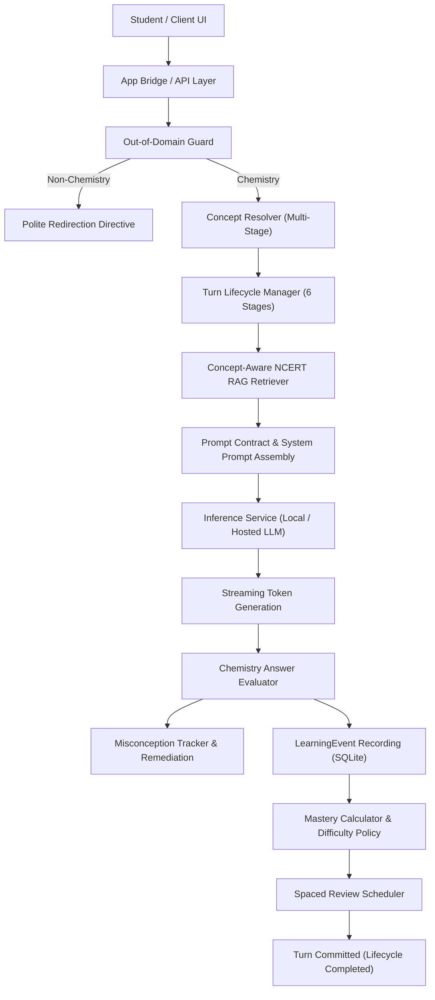
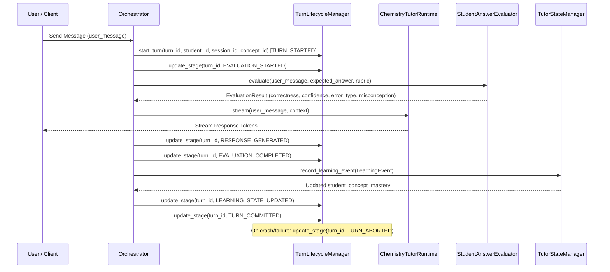

# Gayatri Chemistry Tutor — AI Agent Architecture & Model Training Flow

## 1. System Overview & Core Invariants

The **Gayatri Chemistry Tutor** is an intelligent, NCERT/CBSE-aligned adaptive pedagogical agent for High School (Class 11 & 12) Chemistry, specializing in **Thermodynamics** and **Inorganic Chemistry**.

### Non-Negotiable Invariants
1. **Mode Isolation:**
   $$\text{General Assistant activity} \neq \text{Chemistry learning state}$$
   General assistant conversations, coding help, or non-chemistry turns must **never** mutate student chemistry mastery, review schedules, or misconception records.
2. **Evidence-Driven Mastery:**
   An LLM's free-form confidence is **never** the authoritative signal for student mastery. Mastery is computed mathematically and updated through append-only `LearningEvent` records in SQLite.
3. **Student Data Isolation:**
   Student learning states, mastery scores, misconceptions, and review queues are strictly partitioned by `student_id`. No student's progress or interaction may affect another student.
4. **Controlled Retrieval & Anti-Hallucination:**
   RAG retrieval failure must **never** turn into unrestricted generation. If retrieval fails or returns empty, the model is bound by controlled fallback instructions restricting it to verified core NCERT principles.

---

## 2. End-to-End System Architecture



---

## 3. The 6-Stage Turn Lifecycle (Section 20)

Every chemistry tutoring interaction is treated as an atomic, observable transaction managed by `TurnLifecycleManager`.



### Stage Definitions
1. **`TURN_STARTED`**: Turn ID generated (`turn_<student_id>_<timestamp>_<uuid>`), recorded in `turn_lifecycle` table.
2. **`EVALUATION_STARTED`**: If student provided an answer, answer evaluation begins against rubric/expected values.
3. **`RESPONSE_GENERATED`**: Model streaming/generation finishes and response tokens are buffered.
4. **`EVALUATION_COMPLETED`**: Evaluation output validated and classified.
5. **`LEARNING_STATE_UPDATED`**: `LearningEvent` appended to `learning_events` and `student_concept_mastery` atomically updated.
6. **`TURN_COMMITTED`**: Transaction committed; turn complete.
7. **`TURN_ABORTED`**: If an unhandled exception or abort occurs, turn is marked aborted with `error_detail`. Startup recovery scans uncommitted turns and safely aborts or recovers them without data loss.

---

## 4. Curriculum & Learning Dependency Graph (LDG) (Section 18)

The curriculum is represented as a **Directed Acyclic Graph (DAG)** of learning concepts.

### Schema Requirements
- **Unique Concept IDs:** Programmatic, snake_case or dotted identifiers (e.g. `chem_thermo_first_law`, `chem_inorg_sblock`).
- **Stable Prerequisite IDs:** No unstructured free-text; strictly stable identifiers matching `^[a-zA-Z0-9_.\-]+$`.
- **Strict DAG:** No self-dependencies ($A \rightarrow A$) and no cyclic dependencies ($A \rightarrow B \rightarrow A$ or multi-hop).
- **No Orphan Prerequisites:** Every prerequisite ID must exist in the curriculum graph.
- **Valid Difficulties:** Integer scale $1$ to $5$ or normalized float $0.0$ to $1.0$.

### Core NCERT Concept Graph Overview
```text
System & Surroundings (chem_thermo_system)
  └── First Law of Thermodynamics (chem_thermo_first_law)
        ├── Heat Capacity (chem_thermo_heat_cap)
        │     └── Calorimetry (chem_thermo_calorimetry)
        └── Enthalpy (chem_thermo_enthalpy)
              ├── Hess's Law (chem_thermo_hess)
              │     └── Standard Enthalpy of Formation (chem_thermo_formation)
              └── Entropy (chem_thermo_entropy)
                    └── Gibbs Free Energy (chem_thermo_gibbs)

Periodic Table Trends (chem_inorg_periodic)
  ├── Chemical Bonding (chem_inorg_bonding)
  │     ├── s-Block Elements (chem_inorg_sblock)
  │     └── p-Block Elements (chem_inorg_pblock)
  └── Equation Balancing (chem_balancing)
        └── Stoichiometry & Mole Concept (chem_stoichiometry)
```

---

## 5. Adaptive Learning Engine & Mastery Progression (Sections 14 & 16)

### 5 Difficulty Levels
| Level | Name | Cognitive Target | Example Task |
| :---: | :--- | :--- | :--- |
| **1** | **Recall** | Factual recall of definitions & units | Define open vs isolated system |
| **2** | **Basic** | Single-step formula application | Calculate work done $w = -P\Delta V$ |
| **3** | **Standard** | Standard multi-step problem solving | Apply Hess's Law using 2-3 equations |
| **4** | **Multi-step** | Conceptual synthesis & thermodynamic proofs | Derive $\Delta G$ temperature dependence |
| **5** | **Advanced** | Competitive exam (JEE/NEET) complex problems | Coupled equilibria & non-standard $\Delta G^\circ$ |

### Adaptation Rules
- **Independent Success:** Increase target difficulty level (+1).
- **Hint-Supported Success:** Maintain current difficulty level.
- **Partial Success:** Maintain or reduce difficulty.
- **Conceptual Error:** Reduce difficulty level (-1).
- **2 Consecutive Conceptual Errors:** Trigger prerequisite remediation before returning to active concept.

### Spaced Review Schedule (Section 16)
$$\text{Schedule Steps: } 1\text{ day} \longrightarrow 3\text{ days} \longrightarrow 7\text{ days} \longrightarrow 14\text{ days} \longrightarrow 30\text{ days}$$
- **Failure:** Shortens/contracts interval back to 1 day.
- **Independent Success:** Advances to the next interval in schedule.
- **Hint-Dependent Success:** Maintains current interval (attenuated extension).
- **Delayed Recall Mastery Gating:** High mastery ($\ge 0.85$) cannot be awarded on immediate practice alone; retention must be verified on a due spaced review turn.

---

## 6. Chemistry Answer Evaluation & Misconception Tracking (Sections 12 & 15)

### Section 12 Evaluation Contract
```json
{
  "input": {
    "question_id": "thermo.hess.001",
    "concept_id": "thermo.hess_law",
    "question": "Given ... calculate delta H.",
    "expected_answer": "-110.5",
    "rubric": "Subtract eq 2 from eq 1",
    "student_answer": "-110.5 kJ/mol",
    "question_type": "numerical"
  },
  "output": {
    "correctness": "correct",
    "confidence": 1.0,
    "error_type": "none",
    "misconception": null,
    "recommended_action": "advance"
  }
}
```

### Controlled Misconception Catalog (15 Standard Codes)
#### Thermodynamics:
1. `THERMO_SIGN_CONVENTION`: Confusing work done BY system ($-w$) with work done ON system ($+w$).
2. `HEAT_VS_INTERNAL_ENERGY`: Treating heat ($q$) as a state function or confusing with $\Delta U$.
3. `STATE_VS_PATH_FUNCTION`: Classifying $q$ or $w$ as state functions, or $\Delta H/\Delta U$ as path functions.
4. `ENTHALPY_CONFUSION`: Assuming $\Delta H = \Delta U$ under non-constant pressure conditions.
5. `HESS_LAW_DIRECTION`: Forgetting to invert sign of $\Delta H$ when reversing a thermochemical equation.
6. `CP_CV_CONFUSION`: Incorrectly using $C_p$ in place of $C_v$ or confusing $C_p - C_v = R$.
7. `GIBBS_SIGN_CONFUSION`: Believing $\Delta G > 0$ means spontaneous, or confusing $\Delta H$ and $T\Delta S$ signs.

#### Inorganic Chemistry:
8. `PERIODIC_TREND_CONFUSION`: Assuming ionization energy always increases strictly across period (ignoring half-filled stability like N vs O).
9. `OXIDATION_STATE_ERROR`: Assigning incorrect oxidation states to transition metals or peroxides.
10. `ELECTRONIC_CONFIGURATION_ERROR`: Violating Aufbau/Hund's rule (e.g. Cr $3d^5 4s^1$ vs $3d^4 4s^2$).
11. `COORDINATION_NUMBER_CONFUSION`: Confusing oxidation state with coordination number in complexes.
12. `LIGAND_CONFUSION`: Confusing bidentate/chelating ligands with monodentate ligands.
13. `REDOX_CONFUSION`: Inverting oxidizing agent (reduced) and reducing agent (oxidized).
14. `ANOMALOUS_BEHAVIOUR_CONFUSION`: Forgetting second-period elements lack $d$-orbitals (maximum covalency 4).
15. `METALLURGY_PROCESS_CONFUSION`: Confusing calcination (absence of air) with roasting (excess air).

---

## 7. Concept-Aware RAG Engine (Section 19)

### Multi-Factor Retrieval
The retriever enriches queries with 6 distinct signals:
$$\text{Query Vector} = \text{Embedding}(\text{question} + \text{domain} + \text{chapter} + \text{topic} + \text{concept} + \text{learning\_objective})$$

### Source Priority Weighting
$$\text{NCERT } (10.0) \succ \text{APPROVED\_CURRICULUM } (5.0) \succ \text{FALLBACK } (1.0)$$

### 5 Preserved Metadata Fields
Every chunk returned preserves:
1. `source`: Document origin (e.g. `NCERT_CHEM_11_CH6`)
2. `chapter`: Chapter name (e.g. `Thermodynamics`)
3. `page`/`section`: Textbook page number and section heading
4. `chunk_id`: Deterministic unique chunk hash (`chk_<hash>`)
5. `retrieval_score`: Semantic/lexical similarity score

### Explicit Tracking & Controlled Fallback
- `RAG_OK`: High/medium confidence retrieval; injects formatted NCERT citations.
- `RAG_EMPTY` / `RAG_ERROR`: Injects `[CONTROLLED RAG FALLBACK]`:
  > *"Do NOT speculate or invent chemistry facts beyond verified NCERT core definitions. Guide the student to clarify or review textbook fundamentals."*

---

## 8. Assessment Engine (Section 17)

### 11-Field Question Schema
1. `id`: Unique question identifier (`q_thermo_001`)
2. `concept_id`: NCERT concept (`thermo.hess_law`)
3. `difficulty`: Integer rating ($1$ to $5$)
4. `type`: Question type (`mcq`, `numerical`, `assertion_reasoning`, `reaction_completion`, `equation_balancing`)
5. `question`: Problem prompt text
6. `answer`: Authoritative solution
7. `rubric`: Specific grading criteria
8. `hint`: Pedagogical clue without revealing answer
9. `explanation`: Step-by-step resolution
10. `common_misconceptions`: Targeted misconception codes
11. `source`: Textbook origin (`NCERT`)

### 4 Persistent Database Tables
- `assessment`: Session metadata (`assessment_id`, `student_id`, `status`, `score`, `start_time`, `end_time`).
- `assessment_question`: Full 11-field question records bound to the session.
- `assessment_attempt`: Student submissions with `student_answer`, `is_correct`, `score_fraction`, `feedback`.
- `score`: Final aggregated score with `total_score`, `max_possible`, `score_percentage`, `strengths_json`, `weaknesses_json`.

### Anti-Leakage Client Sanitizer
Before transmitting questions to the client UI, `AssessmentGrader.sanitize_for_client()` strips:
`answer`, `correct_answer`, `explanation`, `grading_notes`, `correct_index`, `correct_option_index`, `expected_value`, `missing_products`, `balanced_equation`.

---

## 9. Model Training & Fine-Tuning Specifications

When generating datasets for Supervised Fine-Tuning (SFT) or Direct Preference Optimization (DPO), models must follow these prompt formats and behavioral guidelines.

### Pedagogical Interaction Cycle
The model must strictly execute the cycle:
$$\text{Explain} \longrightarrow \text{Example} \longrightarrow \text{Ask} \longrightarrow \text{Evaluate} \longrightarrow \text{Adapt} \longrightarrow \text{Continue}$$

### Recommended SFT Prompt Format
```text
<|im_start|>system
You are Gayatri Chemistry Tutor, an authoritative NCERT/CBSE chemistry tutor for Class 11 & 12.
Domain: Thermodynamics
Active Concept: chem_thermo_first_law (First Law of Thermodynamics)
Target Difficulty: Level 2 (Basic)

--- AUTHORITATIVE NCERT EVIDENCE ---
[1] Delta U = q + w according to the first law of thermodynamics. Internal energy (U) is a state function, whereas heat (q) and work (w) are path functions.
    Citation: [NCERT Thermodynamics, Topic: First Law (p. 150)] (Score: 0.8920)
--- END NCERT EVIDENCE ---

Follow the pedagogical cycle. Never hallucinate outside NCERT definitions.
<|im_end|>
<|im_start|>user
What happens to internal energy if a system absorbs 400 J of heat and does 150 J of work?
<|im_end|>
<|im_start|>assistant
Let's analyze this using the **First Law of Thermodynamics**:

$$\Delta U = q + w$$

1. **Identify the heat exchange ($q$):**
   - The system *absorbs* heat $\implies q = +400\text{ J}$.
2. **Identify the work ($w$):**
   - Work is done *by* the system on the surroundings $\implies w = -150\text{ J}$.
3. **Calculate change in internal energy ($\Delta U$):**
   $$\Delta U = (+400\text{ J}) + (-150\text{ J}) = +250\text{ J}$$

The internal energy of the system increases by **$250\text{ J}$**.

**Quick Check for You:**
If the same system now releases $200\text{ J}$ of heat while $50\text{ J}$ of work is done *on* it, what will be the change in its internal energy?
<|im_end|>
```

### Dataset Curation Guidelines for Fine-Tuning
1. **Misconception Remediation Pairs:** Train the model to recognize student answers exhibiting any of the 15 controlled misconception codes and provide targeted remediation without shaming.
2. **Formula & Calculation Precision:** Train the model to verify arithmetic and unit consistency ($1\text{ L}\cdot\text{atm} = 101.325\text{ J}$, $R = 8.314\text{ J}\cdot\text{K}^{-1}\cdot\text{mol}^{-1}$).
3. **Out-of-Domain Rejection:** Train the model to politely decline coding, non-chemistry questions, or general banter and redirect the student to chemistry topics.
4. **Controlled Fallback Responses:** Train the model to acknowledge when external context is missing and guide the student back to core NCERT fundamentals rather than guessing.
